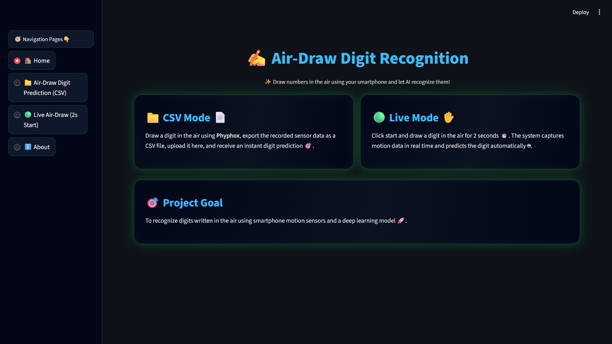
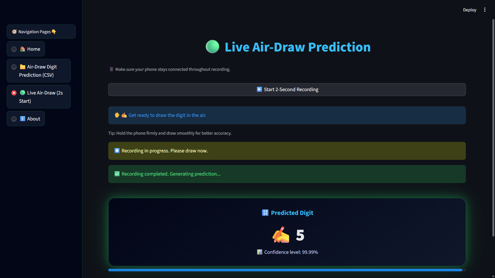
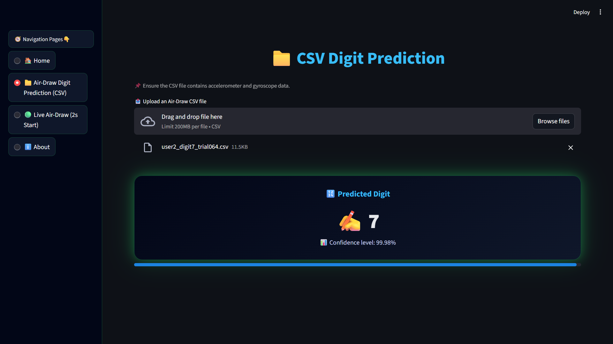
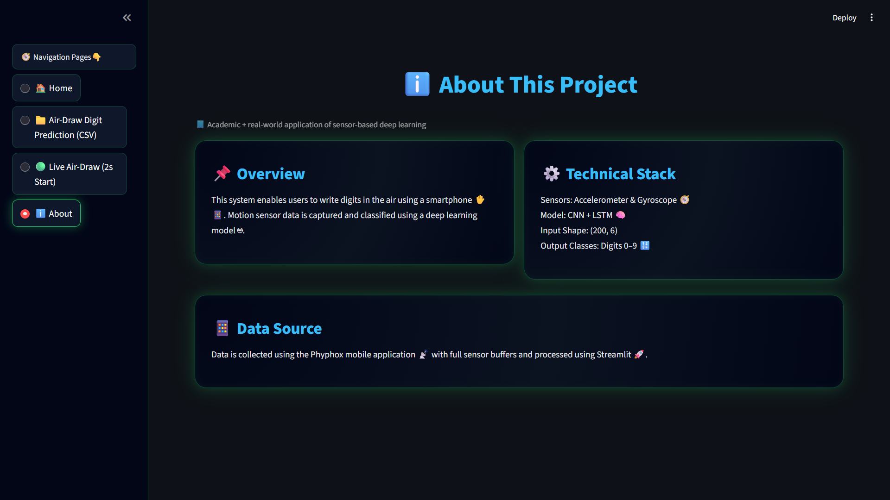

# ✍️ AirDraw: Digit Recognition from Smartphone Motion Sensors

## ❓ Problem Statement: 

This project implements an **Air-Draw Digit Recognition System** that identifies digits (0–9) drawn in the air using smartphone motion sensors. Accelerometer and gyroscope data are collected via the **phyphox** mobile application and classified using a **CNN + LSTM deep learning model**.

---

## 🚀 Project Overview

- Users draw digits in the air using a smartphone.
- Motion sensor data is captured as time-series signals.
- Each recording is resampled to a fixed length.
- A deep learning model predicts the drawn digit.
- A Streamlit web app provides an interactive inference demo.

---

## 🎯 Skills Takeaway

By completing this project, learners gain hands-on experience in:

- Collecting time-series sensor data from smartphone IMU sensors
- Designing a structured data schema and storing sensor data in CSV format
- Preprocessing sequential data (resampling, normalization, padding/truncation)
- Building deep learning models for sequence classification using CNN and LSTM
- Evaluating multi-class classification models using appropriate metrics
- Deploying a simple inference pipeline using Streamlit
- Documenting and presenting an end-to-end deep learning project

---

## 📱 Data Collection

- **Sensors Used:**  
  - Accelerometer (ax, ay, az)  
  - Gyroscope (gx, gy, gz)
- **Tool:** phyphox Android app  
- **Sampling Rate:** 100 Hz  
- **Recording Duration:** 2 seconds per digit  

Each recording is stored as a CSV file with the following structure:
`timestamp`, `ax`, `ay`, `az`, `gx`, `gy`, `gz`

> ⚠️ The dataset is generated locally using the provided data collection script and is **not included** in this repository.

---

## 🧹 Data Preprocessing

- Timestamps aligned to start at 0 seconds
- Each sequence resampled to **T = 200 time steps**
- Feature normalization using StandardScaler (fit on training data only to prevent data leakage)
- The trained scaler is saved and reused during inference
- Final input tensor shape: **(200, 6)**

---

## 🧠 Model Architecture

- **1D Convolutional Layers:** capture local motion patterns
- **LSTM Layer:** captures temporal dependencies
- **Dense Softmax Output:** 10 classes (digits 0–9)

**Input Shape:** `(200, 6)`  
**Output:** Digit class probabilities

---

## 📊 Model Performance

- Achieved **~96–98% accuracy** on the test set
- Evaluated using:
  - Accuracy
  - Precision, Recall, F1-score
  - Confusion Matrix
- The model generalizes well to unseen test samples across varying writing speeds within the collected dataset.

---

## 🌐 Streamlit Application

The Streamlit app allows users to:
- Upload air-draw CSV files
- Perform digit prediction
- Visualize prediction confidence
- Navigate between pages (Home / Prediction / About)

### Run the App:
```bash
streamlit run streamlit_app.py
```

---

## 📸 Streamlit Application Screenshots

<table>
<tr>
<td align="center"><b>🏠 Home Page</b></td>
<td align="center"><b>🎥 Live Prediction</b></td>
</tr>

<tr>
<td></td>
<td></td>
</tr>

<tr>
<td align="center"><b>📂 CSV Prediction</b></td>
<td align="center"><b>ℹ️ About Page</b></td>
</tr>

<tr>
<td></td>
<td></td>
</tr>

</table>

---

## 🎥 Demo Video

<p align="center">
  <a href="https://youtu.be/7c2ATEpAzkc">
    
  </a>
</p>

<p align="center">
<strong>AirDraw Demo:</strong> See how the model predicts air-drawn digits in real time!
</p>

---

## 🔁 Reproducibility

- All dependencies are listed in requirements.txt
- Random seeds are fixed to ensure repeatable experiments
- The trained StandardScaler object is saved and reused during inference to ensure consistent feature scaling

To install dependencies:
```bash
pip install -r requirements.txt
```

---

## 🛠️ Technologies Used

- Python
- NumPy, Pandas
- TensorFlow / Keras
- Scikit-learn
- Streamlit
- phyphox
- Git & GitHub

---

## 🧩 Domain

- **Primary Domain:** Deep Learning, Time-Series Analysis  
- **Sub Domains:** Human–Computer Interaction (HCI), Mobile Computing, IMU Data Analytics

---

## 💼 Business Use Cases

- Touchless numeric input systems for public kiosks and sterile environments
- Gesture-based controls for AR/VR and gaming applications
- Accessibility-focused input methods for users with motor impairments
- Smart device and IoT control using air-written gestures

---

## 🧪 Environment

- Python: 3.13.2
- OS: Windows
- Deep Learning Framework: TensorFlow / Keras

> ⚠️ Note:  
> This project was developed and tested using Python 3.13.2.
> If dependency issues occur, Python 3.10 is recommended as a fallback for broader library compatibility.
---
